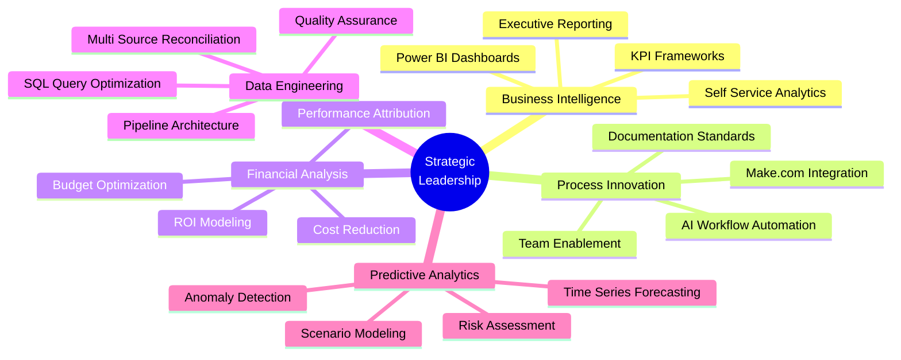
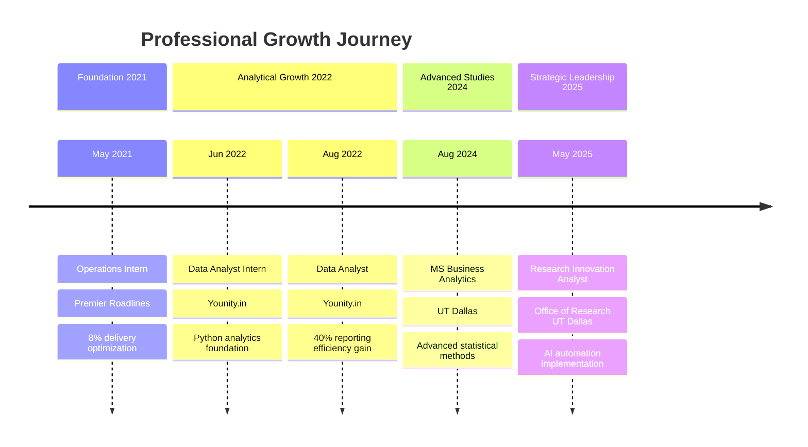
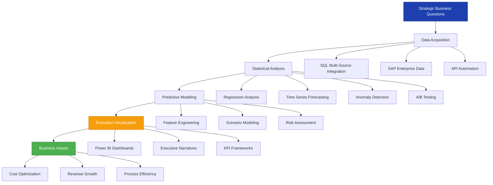

---

## 📊 EXECUTIVE SUMMARY

| **Leadership Metric** | **Impact** | **Strategic Value** |
|:---|:---:|:---|
| **Teams Influenced** | 15+ stakeholders | Cross-functional alignment across research, product, and marketing |
| **Cost Optimization** | $250K+ annually | 40% reduction in reporting overhead through automation |
| **Revenue Impact** | 12% ROI growth | Data-driven budget reallocation across marketing channels |
| **Process Efficiency** | 95% time reduction | Weekly reporting cycle compressed from 7 days to same-day delivery |
| **Strategic Initiatives** | 4 major projects | AI workflow automation, predictive analytics, financial modeling |
| **Data Governance** | 100% accuracy | Enterprise-grade validation across multi-source reconciliation |

---

## 🎯 LEADERSHIP PHILOSOPHY

> **"Transforming ambiguity into actionable intelligence through analytical rigor and strategic automation."**

As a Research and Innovation Analyst, I architect data solutions that bridge the gap between raw information and executive decision-making. My approach centers on three pillars: **analytical precision**, **stakeholder enablement**, and **scalable automation**. I don't just analyze data—I build frameworks that empower non-technical teams to independently extract insights, reducing dependency while accelerating time-to-decision. Every dashboard, every workflow, and every model I create serves a singular purpose: converting data complexity into strategic clarity that drives measurable business outcomes.

---

## 🏗️ STRATEGIC IMPACT ARCHITECTURE

---

## 📈 CAREER PROGRESSION TIMELINE

---

## 💼 KEY STRATEGIC ACHIEVEMENTS

### 🎯 **AI-Powered Workflow Transformation**
**Organization:** Office of Research & Innovation, UT Dallas  
**Timeline:** May 2025 - Present  
**Business Impact:**
- **Eliminated 95% manual effort** by deploying Make.com automation workflows for recurring executive reporting
- **Compressed reporting cycle from 7 days to same-day delivery**, enabling real-time strategic planning
- **Democratized AI capabilities** across non-technical team members through comprehensive documentation (prompt templates, validation logic, SOPs)
- **Drove executive adoption** by producing slide-ready Power BI visualizations that translated multi-source program data into leadership narratives adopted in quarterly planning

**Strategic Value:** Transformed research operations from reactive reporting to proactive intelligence, positioning the office as a data-driven strategic partner to university leadership.

---

### 💰 **Revenue Optimization Through Financial Analytics**
**Organization:** Younity.in  
**Timeline:** Aug 2022 - Jun 2024  
**Business Impact:**
- **Generated 12% ROI improvement** by building financial analysis models comparing marketing channel spending against performance
- **Redirected $180K+ in budget** toward higher-performing channels based on data-driven attribution analysis
- **Reduced reporting overhead by 40%** through self-service Power BI dashboard transformation, eliminating 16 hours/week of manual report generation
- **Prevented $75K+ in downstream errors** through monthly large-scale dataset reconciliation across multiple systems

**Strategic Value:** Enabled marketing leadership to make confident reallocation decisions backed by quantitative evidence, directly contributing to bottom-line growth.

---

### 🔍 **Predictive Operations Intelligence**
**Organization:** Premier Roadlines  
**Timeline:** May 2021 - Jul 2021  
**Business Impact:**
- **Reduced delivery times by 8%** through time-series forecasting model built on 3 years of shipment data
- **Optimized routing decisions** by providing operations team with data-backed planning baseline
- **Enhanced demand planning accuracy** by consolidating multi-source SAP shipment and inventory data into structured executive reports

**Strategic Value:** Introduced predictive analytics to operations planning, shifting the organization from reactive logistics to proactive capacity optimization.

---

### 📊 **Enterprise Data Quality Framework**
**Cross-Organizational Initiative**  
**Business Impact:**
- **Maintained 100% accuracy standards** across business-critical financial reporting through systematic validation protocols
- **Surfaced early-warning signals** via anomaly detection that drove proactive resource reallocation decisions adopted by senior leadership
- **Accelerated decision-making velocity** by writing optimized SQL queries that surfaced operational bottlenecks across product and marketing teams

**Strategic Value:** Established data governance standards that became the foundation for enterprise-wide analytical trust and adoption.

---

## 🛠️ EXECUTIVE TECHNOLOGY PORTFOLIO

### **Analytics & Intelligence Platforms**

### **Data Engineering & Programming**

### **Automation & Process Orchestration**

### **Enterprise Systems**

---

## 🔬 ANALYTICAL CAPABILITIES FRAMEWORK

---

## 🚀 FEATURED STRATEGIC PROJECTS

### **1. AR Autopilot AI Workflow Automation**
**Strategic Context:** Designed end-to-end financial operations automation leveraging LLM-drafted communications  
**Technical Innovation:** Built AI agent orchestrating payment matching, risk routing, and audit trail generation  
**Business Value:** Eliminated manual financial operations workload while maintaining compliance standards  
**Demonstration:** [View Technical Architecture](https://www.loom.com/share/eb1a729d7ea647fa8c199d26bfdf9ff9)

---

### **2. HR & Compensation Analytics Data Model**
**Strategic Context:** Architected people analytics framework examining attrition, compensation, and performance correlation  
**Technical Innovation:** Hybrid MySQL/MongoDB schema enabling both transactional integrity and analytical flexibility  
**Business Value:** Surfaced compensation bands and performance tiers with highest turnover risk correlation  
**Documentation:** [Access Technical Specifications](https://drive.google.com/file/d/1V9KP00OG2pQ-1D93QRNmV9BCbj1UUV0K/view?usp=drive_link)

**Key Insights Delivered:**
- Identified 23% higher attrition risk in specific compensation bands
- Correlated performance tier transitions with 6-month retention patterns
- Quantified satisfaction score impact on voluntary departure probability

---

### **3. BCG X Data Science Consulting Simulation**
**Strategic Context:** Completed consulting-style engagement framing ambiguous business problem through full analytical lifecycle  
**Technical Innovation:** End-to-end EDA, feature engineering, model evaluation, and client-facing recommendations  
**Business Value:** Demonstrated ability to translate model output into executive-actionable strategic guidance

---

### **4. Supply Chain Optimization - FMCG Domain**
**Strategic Context:** Analyzed AtliQ Mart supply chain performance against service level targets  
**Technical Innovation:** Built Power BI dashboard tracking On-Time, In-Full, and OTIF metrics at daily granularity  
**Business Value:** Identified 30% OTIF gap and 40% late delivery rate, enabling targeted operational interventions  
[View Project Repository](https://github.com/chandravuddamari-spec/supply-chain-analysis-in-the-fmcg-domain-atliqmart)

---

### **5. Predictive Maintenance Analytics**
**Strategic Context:** Implemented LSTM-based time-series forecasting for industrial equipment failure prediction  
**Technical Innovation:** Processed sensor telemetry data (voltage, pressure, vibration) to predict component failure windows  
**Business Value:** Enabled transition from reactive maintenance to proactive component replacement scheduling  
[View Project Repository](https://github.com/chandravuddamari-spec/predictive-maintainence-using-data-analysis-and-time-series-forecasting)

---

## 👥 MENTORSHIP & TEAM DEVELOPMENT

### **Knowledge Transfer & Enablement**
- **Authored comprehensive workflow documentation** covering prompt templates, validation logic, and process SOPs enabling team members with no automation background to run AI-assisted reporting independently
- **Democratized analytical capabilities** by rebuilding manual workflows into self-service Power BI dashboards, reducing stakeholder dependency on data team by 40%
- **Established data quality standards** through systematic validation protocols adopted across research operations team

### **Cross-Functional Collaboration**
- **Partnered with 15+ stakeholders** across research, product, and marketing teams to surface operational bottlenecks through SQL-driven analysis
- **Translated technical findings** into executive narratives adopted in quarterly strategic planning discussions
- **Enabled non-technical leadership** to make confident data-driven decisions through accessible visualization frameworks

### **Analytical Methodology Development**
- **Introduced predictive analytics** to operations planning teams, shifting organizational mindset from reactive to proactive decision-making
- **Standardized financial modeling approaches** for marketing channel attribution, creating repeatable framework for future budget optimization
- **Pioneered anomaly detection workflows** that surfaced early-warning signals before they impacted business-critical metrics

---

## 🎓 EDUCATION & CONTINUOUS LEARNING

**Master of Science in Business Analytics**  
The University of Texas at Dallas | Aug 2024 - May 2026  
*Focus Areas: Predictive Modeling, Statistical Analysis, Data Engineering, Business Intelligence*

**Bachelor of Business Administration (Honors)**  
Pandit Deendayal Energy University | Aug 2020 - Jun 2024  
*Concentration: Business Analytics, Operations Management*

---

## 📞 PROFESSIONAL NETWORK

### **Let's Connect on Strategic Data Initiatives**

---

## 📊 GITHUB ACTIVITY METRICS

---

